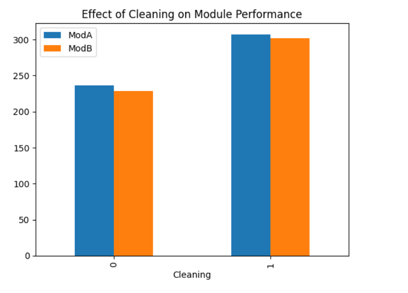
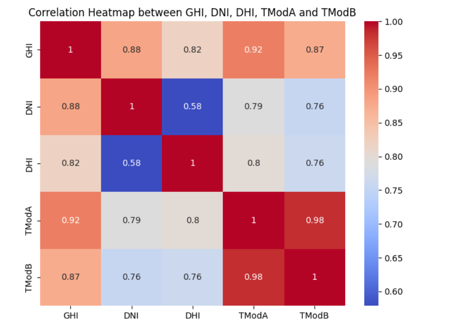
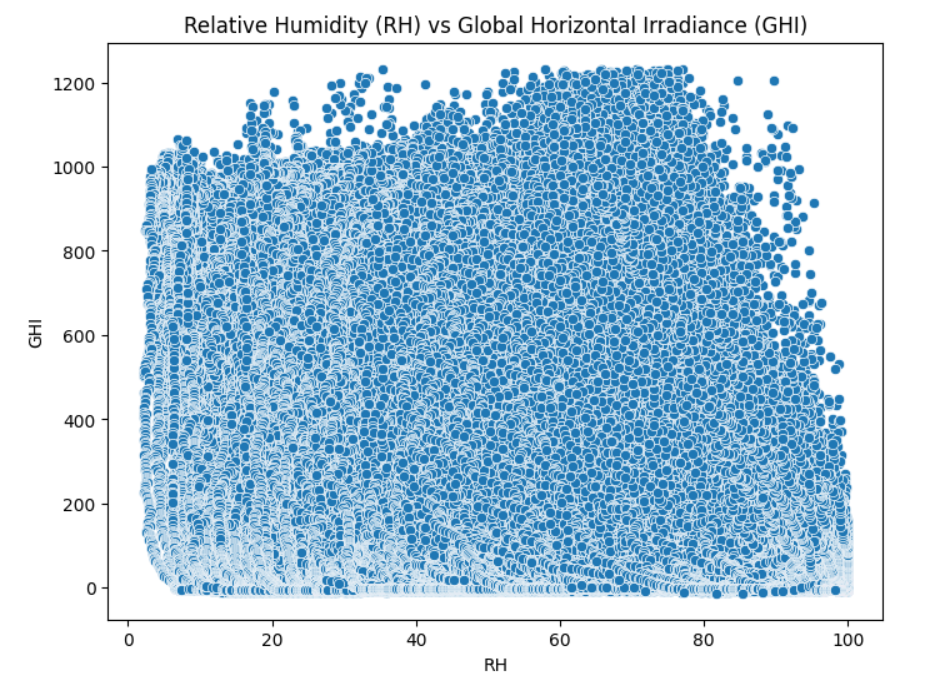
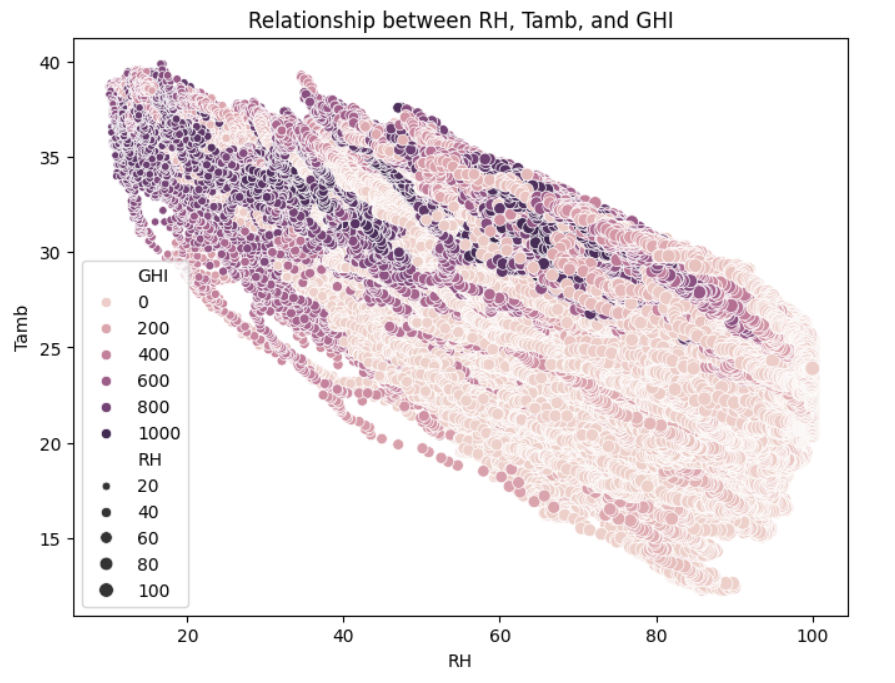
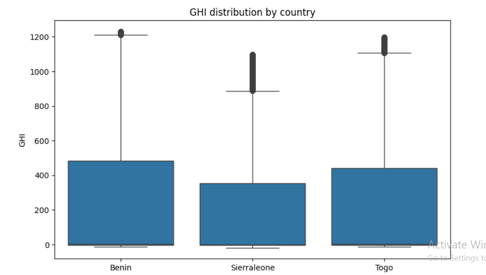
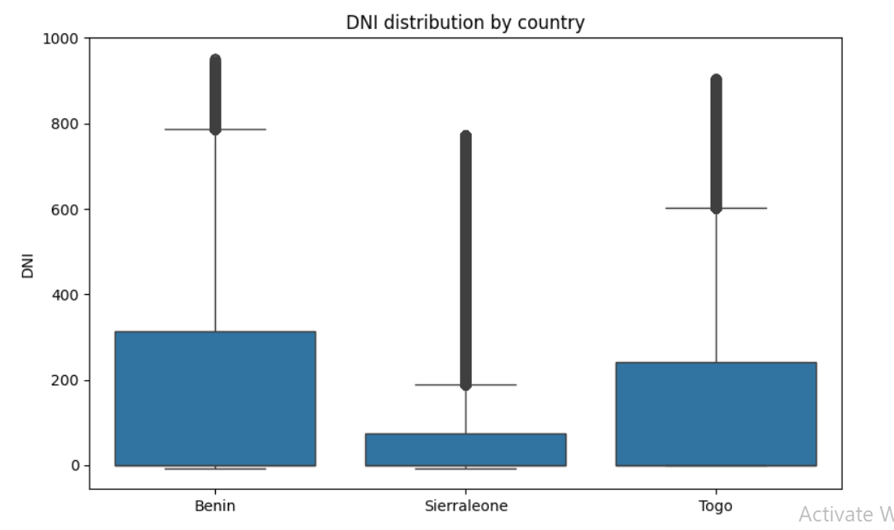
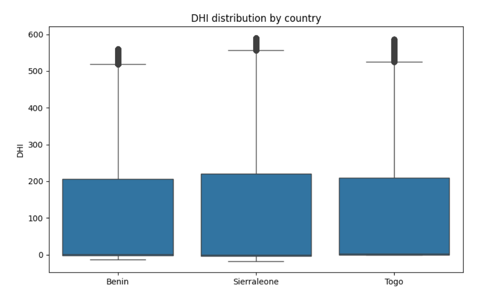
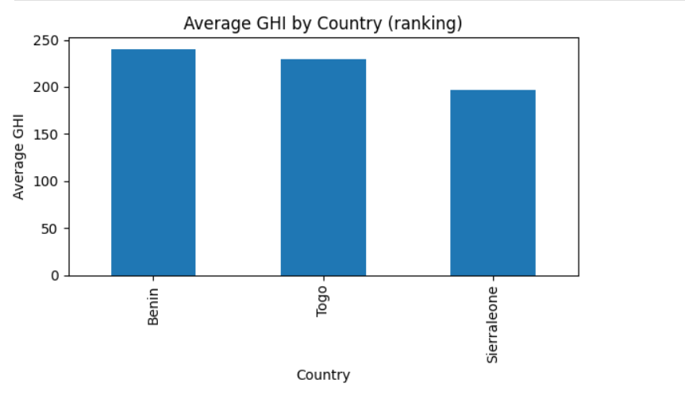

Follow the following steps to reproduce the setup

Create the repository and clone it as follows

    git clone https://github.com/[Username]/solar-challenge-week0.git

Setup the virtual environment and activate it (for Windows using Git bash)
    py -m venv venv
    cd /venv/Scripts/
    source ./activate

Create a setup branch to setup the necessary structure of the files
    git checkout -b setup-task

Once the setup is done proceed to loading the data and doing EDA. A separate branch was used for all countries for a cleaner setup. Accordingly analysis was done on each countries
    git checkout -b eda-country(all three countries separately were created)

The following data shows that of Benin
At first data was loaded into a pandas dataframe and general structure of the data was reviewed (df.describe())

Afterwards, Outliers in a set of columns were cleaned using z_score. All above 3 were flagged and replaced with median vaues. Then the cleaned dataset was exported and used later to compare countries' distribution and get statistical analysis.

This was followed by a Time Series Analysis to show the nature of these metrics throughout time further fine-grained on a monthly and hourly basis.
The hourly basis showed key insights in that it showed the time of the day where these metrics were at their highest. This shows that these metrics showed the highest value around noon.

The effects of Cleaning was then observed. It somehow showed a significant difference highlighting the effects of Cleaning in the modules.

Proceeding with the EDA, relationship between the key columns (i.e. DHI, GHI, DNI, TModA, TModB) was investigated using a heatmap. This showed a higher correlation intensity between TModA and TModB and a lower correlation intensity between DHI and DNI.

Further relationship between GHI and RH was shown through a scatterplot. As anticipated a higher RH has shown lesser GHI.

Following that, the effects of Wind Speed and Wind Direction were analyzed through Windrose. And the resulting plot varied for each countries.

Distribution analysis was also done on two particular metrics (GHI and WS) with 30 bins. Likewise these distributions varied for all three countries showing how differently these metrics were distributed in different locations.

This was followed by a Temperature analysis showing the relationship between RH, GHI and Tamb through scatterplot. The shape of the graph for all countries showed the inverse relationship that exists between Tamb and RH. Although there is a size variation forexample Sierraleone relatively showing a steeper slope but the inverse relationship persisted for all countries. Furthermore, the color and size of the bubbles shows the effects of GHI and RH respectively. Attached below is sample plot for Sierraleone

These analysis was done for all three countries. And the cleaned data was used to compare the nature of these countries on key metrics.

For doing this cross-country comparison first the cleaned csv file was loaded to separate dataframes. An additional column to separate the Country was added to each dataframe to ease the process of identifying them once they're concatenated to one dataframe.

    df_benin['Country']='Benin'
    df_sierraleone['Country']='Sierraleone'
    df_togo['Country']='Togo'

    df = pd.concat([df_benin, df_sierraleone, df_togo], ignore_index=True)

First a box plot comparison on GHI, DNI and DHI distributions were done 

As seen from the images the distributions varies through all countries. There isn't a consistent trend in distribution for any single country. But the following trends were observed.

    > Benin had the highest GHI and DNI distribution and a relatively lower DHI distribution.
    > Sierraleone had the lowest GHI and DNI distribution and the highest DHI distribution.
    > Togo had a mid-level distribution for all three metrics

Afterwards, a summary dataframe was initialized and populated with the mean, median and standard deviation of the earlier metrics for all countries using the Country column as an index. And the following key observations were made.

    > Benin has the highest standard deviation in GHI and DNI, but the least in DHI; relatively showing a higher variabity and a lower variability on the mentioned metrics respectively.
    > Sierraleone consistently shows the least median throughout all metrics indicating that relatively it's skewed to the left.
    > Togo is contrary to what's been observed in the median of Sierraleone; in that it's consistently showing the highest median, suggesting that it's skewed to the right.

Statistical Analysis to show the mean variation of GHI across these countries. The results show that there is a high variation of mean GHI with a very low p-value showing that the result is very unlikely to be by chance.

Finally a bar chart ranking was done to show the average GHI ranking. The ranking is as shown below.

