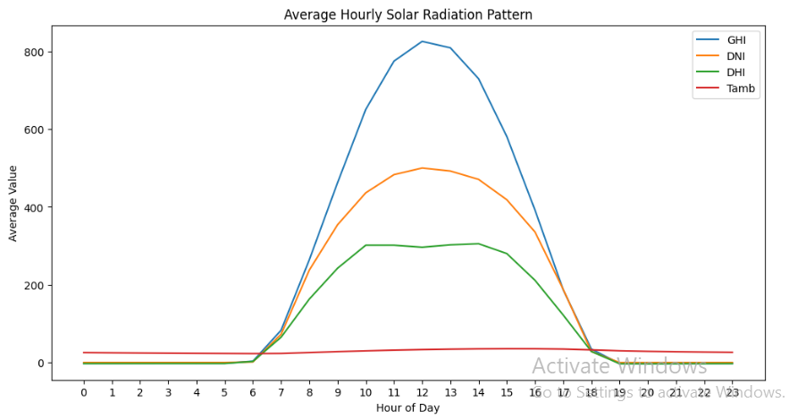

Follow the following steps to reproduce the setup

Create the repository and clone it as follows
--- git clone https://github.com/[Username]/solar-challenge-week0.git

Setup the virtual environment and activate it (for Windows using Git bash)
--- py -m venv venv
--- cd /venv/Scripts/
--- source ./activate

Create a setup branch to setup the necessary structure of the files
--- git checkout -b setup-task

Once the setup is done proceed to loading the data and doing EDA. A separate branch was used for all countries for a cleaner setup. Accordingly analysis was done on each countries
--- git checkout -b eda-country(all three countries separately were created)

The following data shows that of Benin
At first data was loaded into a pandas dataframe and general structure of the data was reviewed (df.describe())

Afterwards Outliers in a set of columns were cleaned using z_score. All above 3 were flagged and replaced with median vaues. Then the cleaned dataset was exported and used later to compare countries' distribution and get statistical analysis.

This was followed by a Time Series Analysis to show the nature of these metrics throughout time further fine-grained on a monthly and hourly basis.
The hourly basis showed key insights in that it showed the time of the day where these metrics were at their highest. This shows that these metrics showed the highest value around noon.

